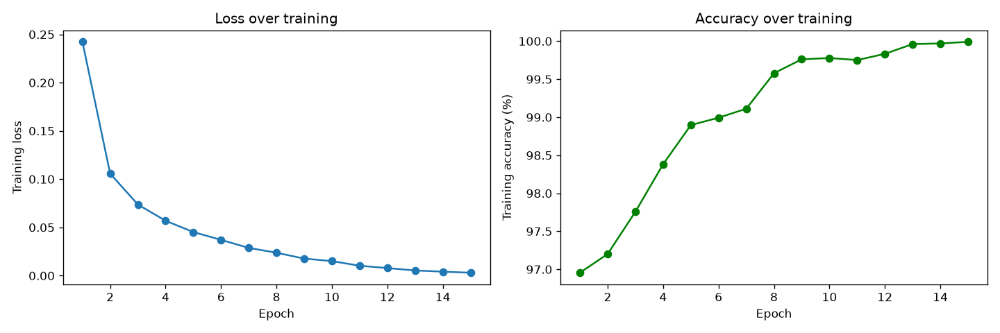
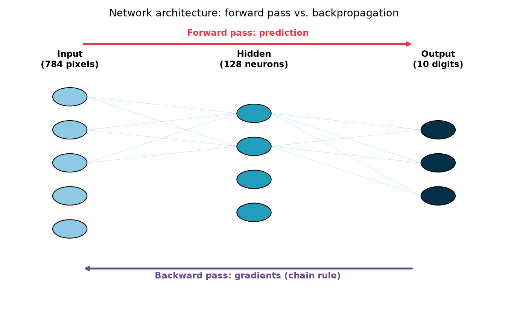

# Neural Net From Scratch

A handwritten-digit recognizer built with nothing but NumPy — forward pass, backpropagation, and gradient descent all implemented and verified by hand, no ML framework involved.



## Problem / Motivation

It's easy to call `model.fit()` in scikit-learn or PyTorch without ever seeing what actually happens inside. This project builds a neural network the hard way — one matrix multiplication and one derivative at a time — to prove an honest, verifiable understanding of the math behind machine learning, not just the ability to call a library.

## Key Findings

- **98.14% test accuracy** on MNIST (10,000 handwritten digit images the network never trained on), after 15 epochs of training.
- **Backpropagation verified correct via gradient checking**: analytical gradients matched independent numerical estimates to within 6×10⁻⁸ relative error — far below the 1×10⁻⁷ threshold considered a passing check.
- **Consistent across all 10 digits**: per-digit test accuracy ranges from 97.5% to 99.2% — no digit is a major weak spot.
- **Cross-validated against scikit-learn**: an independent `MLPClassifier` with the same architecture reaches a comparable 97.69% under the same number of iterations — strong evidence this from-scratch implementation is genuinely correct, not accidentally lucky.
- Misclassified digits are genuinely ambiguous handwriting (see `assets/misclassified_examples.png`), not random failures — a sign the network learned real patterns.

## Tech Stack

- Python 3, NumPy (the entire network: init, forward pass, backprop, gradient descent)
- Matplotlib (loss curves, digit visualizations)
- scikit-learn (used only for the independent sanity-check comparison in Step 5, never for the network itself)
- Data: MNIST, parsed from the raw binary format by hand

## How it works

```
mnist_loader.py  -> parses the raw MNIST IDX binary format into NumPy arrays
network.py       -> init_params, relu, softmax, forward, cross_entropy_loss, backward
train.py         -> mini-batch gradient descent training loop
```

**Architecture:** 784 input neurons (one per pixel) → 128 hidden neurons (ReLU activation) → 10 output neurons (softmax, one per digit).



### The math, in plain words

**Forward pass:** an image's 784 pixel values get multiplied by learned weights, summed, and passed through an activation function — twice (input→hidden, then hidden→output) — ending in 10 probabilities, one per digit.

**Backpropagation and the chain rule:** the loss (how wrong the prediction was) depends on the output layer, which depends on the hidden layer, which depends on the very first weights. To find out how a single early weight affects that final loss, you multiply together the effect of each link in that chain: how the hidden layer responds to that weight, times how the output responds to the hidden layer, times how the loss responds to the output. That's the chain rule — and computing it by working *backward* from the loss to the first layer is what gives backpropagation its name.

**Gradient descent:** once every weight's effect on the loss (its gradient) is known, each weight takes a small step in the direction that *reduces* the loss. Repeated thousands of times, across thousands of images, this is the entire mechanism by which the network "learns."

## Getting Started

```bash
git clone https://github.com/Tanos3000/neural-net-from-scratch.git
cd neural-net-from-scratch
python3 -m venv venv
source venv/bin/activate
pip install -r requirements.txt

python download_data.py    # downloads MNIST into data/
jupyter notebook            # run notebooks 01 to 05 in order
```

## Data Source

[MNIST](http://yann.lecun.com/exdb/mnist/) — 70,000 handwritten digit images (60,000 train / 10,000 test), downloaded from Google's public mirror of the original files. Public domain.

## What I learned

Gradient checking was the most valuable part of this project — without it, I'd have had no way to know whether my backpropagation math was subtly wrong versus just producing a mediocre result. I also learned a real lesson about fair comparisons the hard way: my first attempt at sanity-checking against scikit-learn used identical raw hyperparameters and scored only 28%, which briefly made me doubt my own implementation, until I realized scikit-learn's optimizer interprets those numbers completely differently — the honest fix was comparing against its sensible defaults instead of forcing identical numbers onto two different algorithms.
